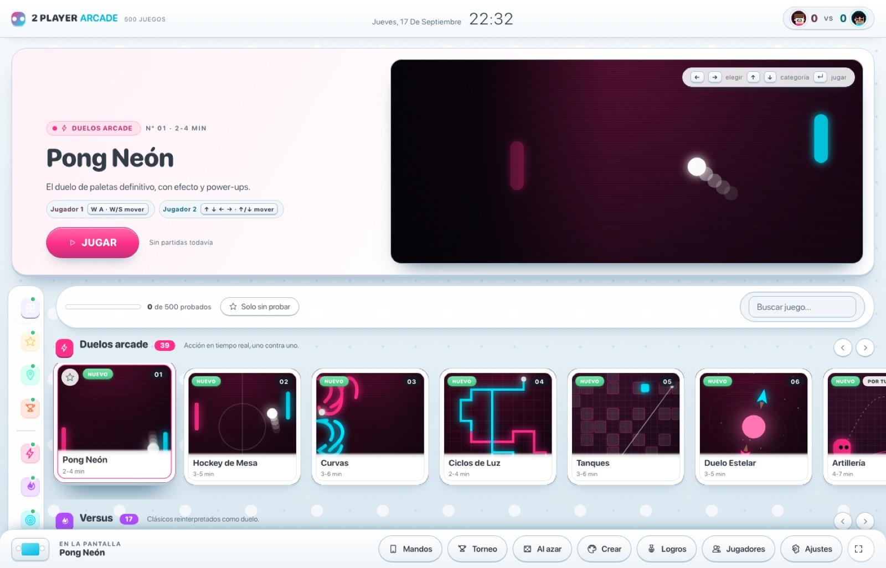
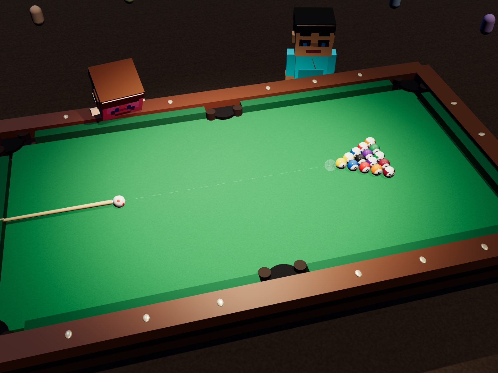
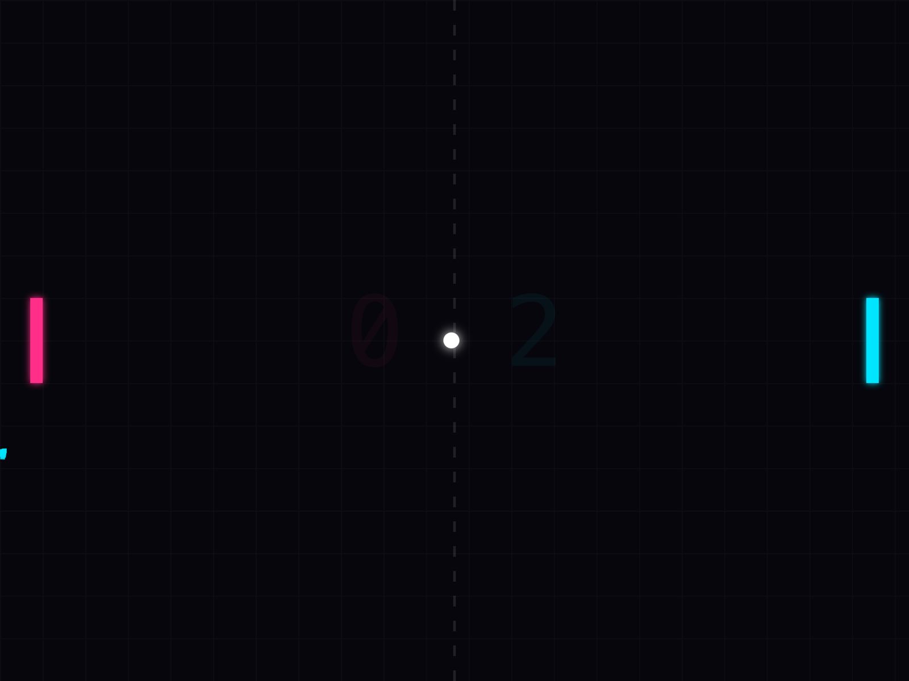

# 2 Player Arcade

500 minijuegos para dos personas en el mismo teclado. sin internet, sin cuentas,
sin instalar nada. html + css + js vanilla, cada juego en su propia carpeta.

[**pruébalo en vivo**](https://kisnner26.github.io/2-player-web/) — corre directo
en el navegador, sin servidor.



## qué trae

- 500 juegos de teclado compartido, más 20 exclusivos de touch bar (solo en la
  app de escritorio)
- 40 juegos pensados para pareja, 24 cooperativos, 261 arenas generadas
- mando dualshock 4 opcional, funciona en los 500 sin configurar nada
- música y ambiente sintetizados por código, cero archivos de audio
- perfiles con avatar generado a partir de una foto, sin salir de tu máquina
- un editor de juegos: crea reglas por datos, sin escribir código

39 de esos juegos son 3d de verdad, con física escrita a mano (rozamiento,
rebote, péndulos):



y el resto, duelos rápidos en 2d con efecto neón:



## cómo se juega

```bash
git clone https://github.com/kisnner26/2-player-web.git
cd 2-player-web
./start.command
```

eso levanta un servidor local (necesario porque los navegadores bloquean los
módulos es cuando abres con `file://`) y abre el menú.

controles: `WASD` + `espacio`/`E` para el jugador 1, flechas + `M`/`N` para el
jugador 2. remapeables desde ajustes.

## sobre la versión de github pages

el enlace de arriba sirve los 500 juegos de teclado tal cual — son estáticos,
no necesitan nada más. lo único que **no** funciona ahí es el mando táctil por
red local (necesita el servidor con websocket corriendo en tu máquina) y los
juegos de touch bar (necesitan la app de escritorio con electron). para esas
dos cosas, clona y corre `./start.command` o `cd desktop && npm start`.

## documentación completa

el catálogo entero, cómo añadir un juego, el sistema de física 3d, el editor
de personajes y todo lo demás está en [`docs/DETALLES.md`](docs/DETALLES.md).

## licencias

todo el arte se genera por código y todo el sonido se sintetiza — no hay
ningún recurso de terceros. detalles en [`assets/LICENSES.md`](assets/LICENSES.md).
